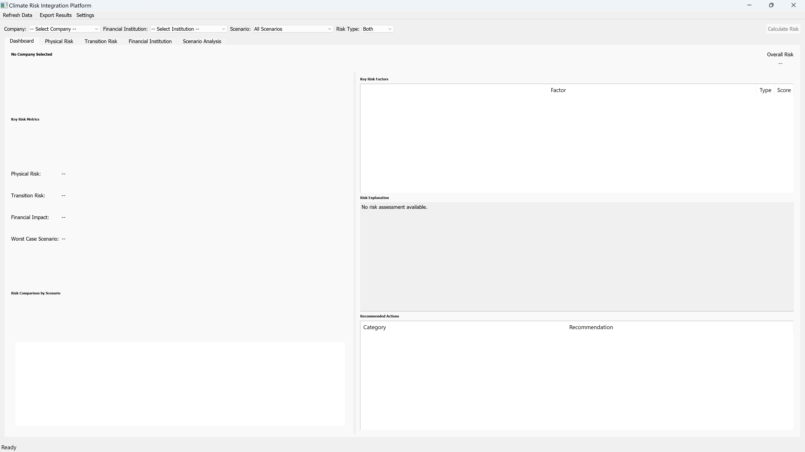
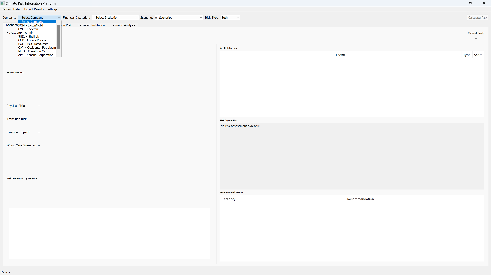
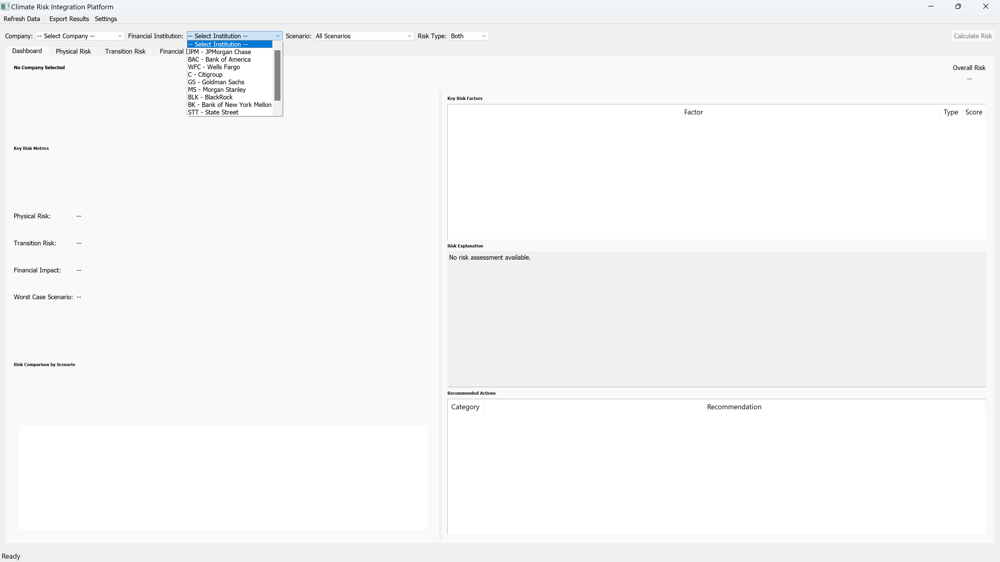
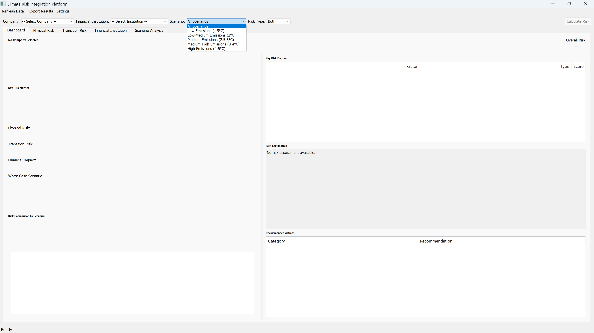

# Climate Risk Integration Platform

A comprehensive climate risk assessment platform for the oil and gas sector, integrating physical and transition risks with financial institution exposure analysis. Features quantum-inspired optimization and explainable AI.

## Screenshots

<p align="center">
  &nbsp;&nbsp;
</p>
<p align="center">
  &nbsp;&nbsp;
</p>

## Architecture

```
├── main.py                    # Application entry point & controller
├── config/
│   └── default_config.yaml    # Default configuration
├── core/
│   ├── config.py              # Configuration management
│   ├── data_manager.py        # Multi-source data acquisition & caching
│   ├── risk_engine.py         # Risk computation engine
│   ├── ai_scenario_generator.py   # AI-driven scenario generation
│   └── quantum_optimizer.py   # Quantum-inspired portfolio optimization
├── data/
│   ├── climate.py             # NASA POWER & NOAA climate data
│   ├── energy.py              # EIA energy market data
│   └── financial.py           # Alpha Vantage financial data
├── ui/
│   ├── main_window.py         # Main PyQt5 application window
│   ├── dashboard_tab.py       # Risk overview dashboard
│   ├── physical_risk_tab.py   # Physical climate risk analysis
│   ├── transition_risk_tab.py # Transition risk modeling
│   ├── financial_institution_tab.py  # Financial exposure analysis
│   └── scenario_tab.py        # Scenario analysis interface
├── utils/
│   ├── logger.py              # Logging configuration
│   ├── cache.py               # Data caching layer
│   └── explainer.py           # SHAP-based model explainability
└── requirements.txt
```

## Key Features

- **Physical Risk Assessment** — Climate hazard exposure (flooding, extreme heat, storms) via NASA POWER/NOAA
- **Transition Risk Modeling** — Regulatory, market, and technology risks for fossil fuel assets
- **Financial Exposure Analysis** — Climate risk mapping to institutional portfolios
- **AI Scenario Generation** — ML-driven climate/economic scenario modeling
- **Quantum-Inspired Optimization** — Portfolio optimization using PennyLane
- **Explainable AI** — SHAP-based model interpretability
- **Interactive Dashboard** — Multi-tab PyQt5 GUI with real-time visualization

## Requirements

```
pip install -r requirements.txt
```

Key dependencies: PyQt5, TensorFlow, PennyLane, SHAP, GeoPandas, Folium, Plotly, scikit-learn

## Setup

1. Clone the repository
2. Install dependencies: `pip install -r requirements.txt`
3. Copy `.env.example` to `.env` and add your API keys
4. Run: `python main.py`

## API Keys Required

- NASA POWER API
- NOAA CDO API
- Alpha Vantage API
- EIA API

## Author

Dr. Mosab Hawarey PhD, Geodetic & Photogrammetric Engineering (ITU) | MSc, Geomatics (Purdue) | MBA (Wales) | BSc, MSc (METU)

- GitHub: https://github.com/mhawarey
- Personal: https://hawarey.org/mosab
- ORCID: https://orcid.org/0000-0001-7846-951X


## License

MIT License
